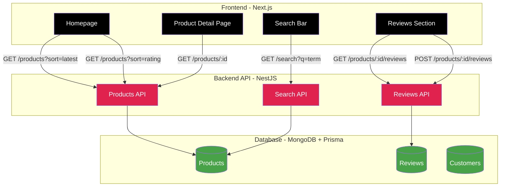

# agital.soft Shop — Monorepo (Frontend + Backend)

 
 
 


## Quick Start

1. Umgebungsvariablen setzen
   - Backend `backend/.env`:
     ```env
     MONGODB_URI="mongodb://localhost:27017/agital-shop"
     CORS_ORIGIN="http://localhost:3000"
     PORT="4000"
     NODE_ENV="development"
     ```
   - Frontend `frontend/.env.local`:
     ```env
     NEXT_PUBLIC_API_BASE_URL="http://localhost:4000"
     ```

2. Abhängigkeiten installieren
   ```bash
   cd backend && npm install
   cd ../frontend && npm install
   ```

3. Datenbank vorbereiten
   ```bash
   cd backend
   npm run prisma:generate
   npm run prisma:push
   npm run prisma:seed # optional
   ```

4. Development starten
   ```bash
   # Backend (http://localhost:4000)
   npm run start:dev
   
   # Frontend (http://localhost:3000)
   cd ../frontend
   npm run dev
   ```

5. Deployment (überblick)
   - Vercel (Frontend): `NEXT_PUBLIC_API_BASE_URL=https://agital-shop.onrender.com`
   - Render (Backend/Docker): `MONGODB_URI`, `CORS_ORIGIN=https://agital-shop.vercel.app`, `NODE_ENV=production`, Health Check: `/products`

Vollständige digitale Shop‑Anwendung bestehend aus einem NestJS‑Backend (Prisma + MongoDB) und einem Next.js‑Frontend. Dieses README fasst die wichtigsten Schritte zur Installation, Konfiguration und zum Starten zusammen und beschreibt die API‑Abrufarchitektur im Frontend.

## Funktionen

- Produkte: Liste, Sortierung der 10 neuesten, der 10 bestbewerteten, Detail per ID
- Bewertungen: Erstellung von Bewertungen, Filtern nach Produkt oder Bewertung, Durchschnitt berechnen
- Suche: Volltextsuche (Name, Version, Beschreibungen)

## Verzeichnisstruktur

- `backend/` — NestJS‑API (Prisma + MongoDB)
- `frontend/` — Next.js‑Anwendung (App Router)

## Installation

```bash
# Backend
cd backend
npm install

# Frontend
cd ../frontend
npm install
```

## Konfiguration

- Backend (`backend/.env`)

```env
DATABASE_URL="mongodb://localhost:27017/agital-shop"
```

- Frontend (`frontend/.env.local`)

```env
NEXT_PUBLIC_API_BASE_URL="http://localhost:4000"
```

## Datenbank (Backend)

```bash
# Prisma‑Client generieren
npm run prisma:generate

# Schema in die Datenbank übertragen
npm run prisma:push

# Datenbank mit Beispieldaten befüllen
npm run prisma:seed
```

## Entwicklung starten

```bash
# Terminal 1 — Backend
cd backend
npm run start:dev
# API verfügbar unter http://localhost:4000

# Terminal 2 — Frontend
cd frontend
npm run dev
# Frontend verfügbar unter http://localhost:3000
```

## Lokale Produktion starten

```bash
# Backend
cd backend
npm run build
npm run start:prod

# Frontend
cd frontend
npm run build
npm start
```

## API‑Endpunkte (Backend)

- Produkte
  - `GET /products` — Alle Produkte
  - `GET /products?sort=latest` — 10 neueste Produkte
  - `GET /products?sort=rating` — 10 bestbewertete Produkte
  - `GET /products/:id` — Produkt nach ID
- Bewertungen
  - `GET /reviews?productId=xxx` — Bewertungen für ein Produkt
  - `GET /reviews?rating=5` — Nach Bewertung filtern
  - `GET /reviews/average?productId=xxx` — Durchschnittsbewertung
  - `POST /reviews` — Bewertung erstellen
- Suche
  - `GET /search?q=super` — Suche nach Schlüsselwort

## Fetch‑Architektur (Frontend)

- HTTP‑Wrapper: `frontend/lib/api.ts`

```ts
const BASE_URL = process.env.NEXT_PUBLIC_API_BASE_URL || "http://localhost:4000"

export async function apiGet(path: string) {
  const res = await fetch(`${BASE_URL}${path}`, { cache: "no-store" })
  if (!res.ok) throw new Error(`HTTP ${res.status}`)
  return res.json()
}

export async function apiPost(path: string, body: any) {
  const res = await fetch(`${BASE_URL}${path}`, {
    method: "POST",
    headers: { "Content-Type": "application/json" },
    body: JSON.stringify(body),
  })
  if (!res.ok) throw new Error(`HTTP ${res.status}`)
  return res.json()
}
```

- Schlüssel‑Seiten und Aufrufe:
  - `frontend/app/products/page.tsx` — `apiGet('/products')`, `apiGet('/products?sort=latest')`, `apiGet('/products?sort=rating')`
  - `frontend/app/products/[id]/page.tsx` — `apiGet('/products/:id')`, `apiPost('/reviews', {...})`
  - `frontend/app/search/page.tsx` — `apiGet('/search?q=motCle')`

### Schnellbeispiele

```ts
// Produktliste
const products = await apiGet('/products')

// Neueste Produkte
const latest = await apiGet('/products?sort=latest')

// Produktdetails
const product = await apiGet(`/products/${id}`)

// Suche
const results = await apiGet(`/search?q=${encodeURIComponent(q)}`)

// Bewertung erstellen
await apiPost('/reviews', { rating, name, text, productId: id })
```

## Hinweise

- Das Frontend erwartet, dass die API unter `NEXT_PUBLIC_API_BASE_URL` erreichbar ist.
- Bei HTTP‑Fehlern werfen die Wrapper eine Ausnahme (`HTTP <Statuscode>`).
- Stellen Sie sicher, dass MongoDB unter der in `DATABASE_URL` angegebenen URL erreichbar ist.

## Keepalive (ohne Cron)

- Zweck: Die Render‑Instanz wach halten, ohne geplante Jobs.
- Implementierung: clientseitige Komponente pingt alle 14 Minuten das Backend.
  - Datei: `frontend/components/keepalive.tsx`
  - Einbindung: `frontend/app/layout.tsx` rendert `<KeepAlive />` global.
- Funktionsweise: `fetch(${`process.env.NEXT_PUBLIC_API_BASE_URL`}/products)` bei Mount und im 14‑Minuten‑Intervall.
- Anpassen/Deaktivieren:
  - Intervall in `setInterval` ändern.
  - `<KeepAlive />` aus `app/layout.tsx` entfernen, um die Funktion zu deaktivieren.

---

Entwickelt von Aime Boaz Siekonha
## 🏗️ Architektur

